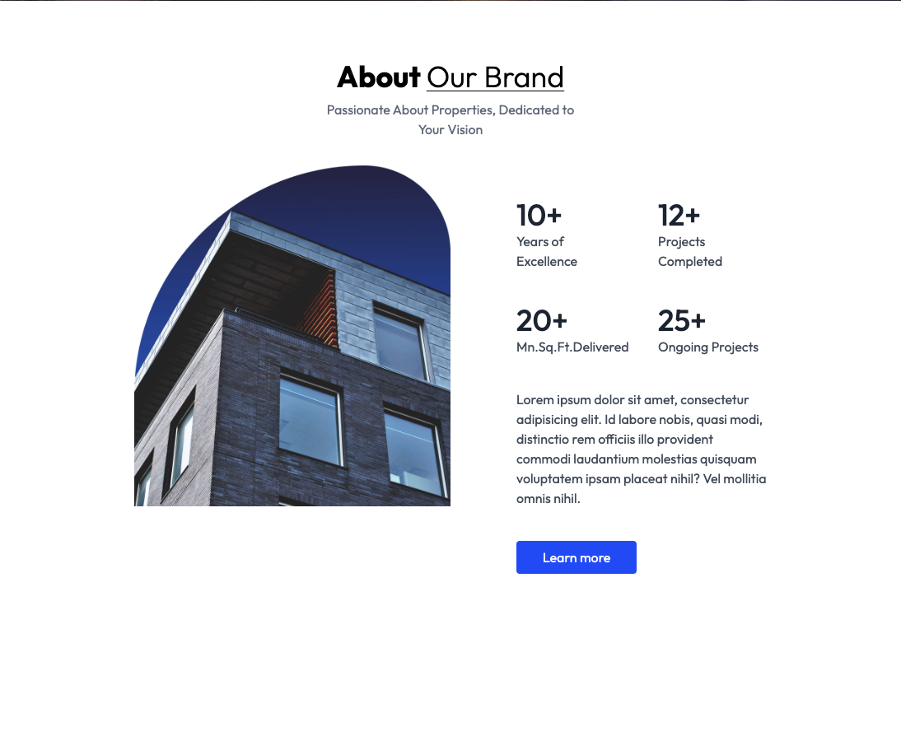
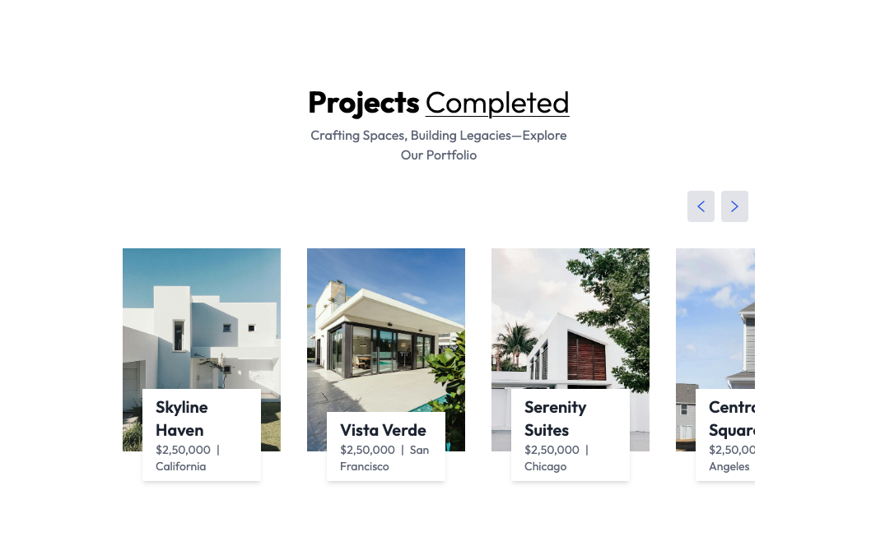
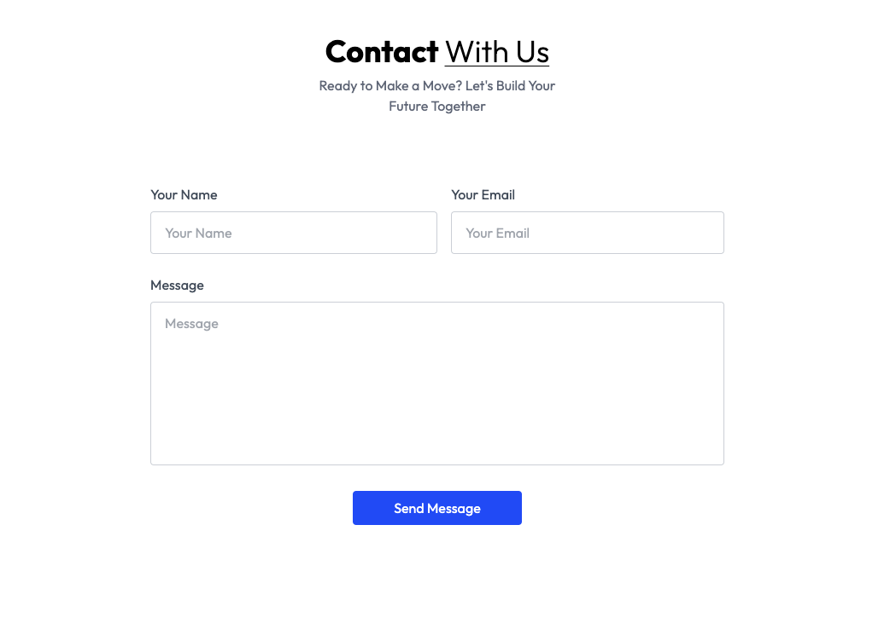

# 🏠 Real Estate Landing Page - Tailwind CSS + React + Framer Motion

A modern, responsive real estate landing page built with **React**, styled using **Tailwind CSS**, and animated with **Framer Motion**. Designed to showcase property listings with clean UI and smooth animations — perfect for real estate businesses or frontend developers looking for UI inspiration.

## ✨ Features

- 🔥 Built with **React** and **Vite** for fast development
- 🎨 Styled with **Tailwind CSS** for utility-first responsiveness
- 🧩 Animated using **Framer Motion** for smooth transitions
- 📱 Fully responsive on all devices
- 💡 Clean, minimal, and developer-friendly codebase

## 🚀 Tech Stack

- **React** – Frontend framework
- **Tailwind CSS** – Utility-first CSS
- **Framer Motion** – Declarative animations for React
- **Vite** – Fast and optimized build tool (optional if used)

## 📸 Screenshots







<!-- Add actual screenshots from your project -->

## 🛠️ Installation & Setup

```bash
# Clone the repository
git clone https://github.com/your-username/real-state-tailwindcss.git
cd real-state-tailwindcss

# Install dependencies
npm install

# Run the development server
npm run dev
```
